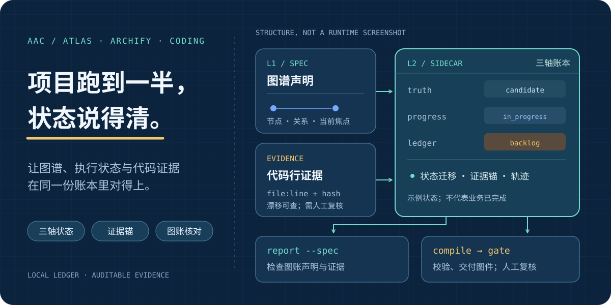
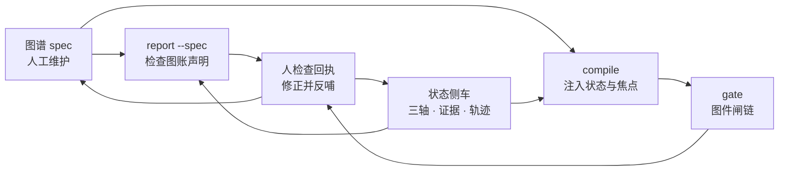

# atlas-archify-coding (aac)

**项目跑到一半，谁也说不清现在是什么状态？**

<p align="center">
  <picture>
    <source media="(max-width: 600px)" srcset="docs/assets/aac-overview-mobile.svg" />
    
  </picture>
</p>

<p align="center"><strong>Atlas + Archify + Coding</strong> · 图谱驱动研发（ADD）的状态与证据工具。<br/>图是投影，代码是实相；让两者的差异有处可查。</p>

<p align="center"><a href="#workflow">看工作流</a> · <a href="#quickstart">开始使用</a> · <a href="#boundaries">能力边界</a></p>

项目中后期，文档可能过时、轨迹留在聊天里、`已完成`缺证据。aac 把**节点状态、代码行证据、图账核对与执行轨迹**放进可查询的本地账本；需要人决定做什么，工具负责记录、检查并指出不一致。它是零运行时依赖的 Node CLI（Node >= 18），不是在线服务。

## 你想确认什么

| 问题 | 可核查的内容 | 命令入口 |
| --- | --- | --- |
| 谁在做，什么还没销账？ | `truth / progress / ledger` 三轴状态与活账；迁移违反规则会拒写 | `state get` · `state active` |
| “已验证”依据在哪？ | `文件:行` 证据锚及内容哈希；`doctor` / `report` 可披露漂移与检查边界 | `state evidence-add` · `doctor` |
| 图与账的完成声称是否一致？ | `report --spec` 对比 spec 节点与账本（A1）；不代业务验收 | `report --spec` |
| 之前为什么这样推进？ | 手动锚定的轨迹、可回放时间线与经验条目 | `trace replay` · `lessons list` |
| 图件能否交付？ | `compile` 注入状态与焦点；`gate` 串行校验图件并披露结果 | `compile` · `gate` |

<a id="workflow"></a>
## 工作流：图、账、证据各守其位



`state` 改账，`report` 查声明与证据，`gate` 验图件。**没有自动读心或自动捕获会话轨迹**：每次推进由调用者显式执行；`verified` 是有证据的验证声明，`settled` 是销账事件，不是机器替你完成业务验收。图件机器通过后仍须人工视觉复核。

<a id="quickstart"></a>
## 开始使用

```bash
git clone https://github.com/agnitum2009/atlas-archify-coding.git && cd atlas-archify-coding
node bin/atlas-engine.mjs --help
node bin/atlas-engine.mjs init --dir ./demo-atlas --title Demo --diagram-id main
node bin/atlas-engine.mjs state set --node demo-task --axis progress --value in_progress --class task --reason 开工 --owner reviewer --sidecar ./demo-atlas/state/atlas-state.json
node bin/atlas-engine.mjs state get --node demo-task --sidecar ./demo-atlas/state/atlas-state.json
```

这个示例只在新建的 `demo-atlas` 中登记并读取一个**进行中**节点，不声称已验证或销账。真正结案需先落可解析的证据锚，再调用 `state settle`；见 [完整一刀示例](docs/USAGE.md#三标准作业流一刀完整示例)。安装后 `aac` 与 `atlas-engine` 是同一 CLI 的两个名字。

**图形内核单独安装。** `gate` 需要 [Archify](https://github.com/tt-a1i/archify)；本仓不内置它。将 `ARCHIFY_BIN` 指向其 `bin/archify.mjs`，或让 `archify` 位于 PATH。缺失时 `gate` 明确失败，不会伪报通过；`report --spec` 只读取 spec JSON，账本、状态、证据与轨迹命令也无需安装 Archify。内核 v2.x 为三闸，v3 加溯源 `check` 为四闸（validate → deliver →〔check〕→ visual-check）。

<a id="boundaries"></a>
## 能力边界

- **适用**：已经开工、进度与证据逐渐失控的项目。`init` 只建图谱数据根，不生成业务代码，不判断优先级。
- **事实与声明分开**：`report` 检查已登记的图账与证据，不推断未登记代码的业务完成度；`gate` 只验图件，不代人工审图。侧车是本地明文文件，写入以单写者为前提；不提供加密、多租户或并发执行调度。
- **按需深入**：[命令与作业流](docs/USAGE.md) · [非程序员上手](docs/QUICKSTART-NONCODER.md) · [规范](specs/ADD-SPEC.md) · [版本记录](RELEASES.md) · [贡献说明](CONTRIBUTING.md)。

MIT 许可。公开仓由上游机械投影；修改受投影管辖的文件请通过 PR，维护者先回流再投影，不会覆盖贡献者改动。
